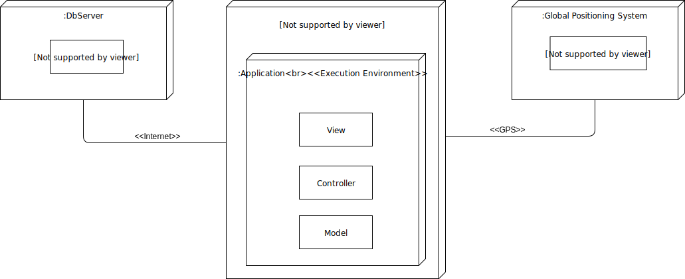

# openCX-nav-inc Development Report

Welcome to the documentation pages of the Campus NAV of **openCX**!

You can find here detailed about the (sub)product, hereby mentioned as module, from a high-level vision to low-level implementation decisions, a kind of Software Development Report (see [template](https://github.com/softeng-feup/open-cx/blob/master/docs/templates/Development-Report.md)), organized by discipline (as of RUP):

* [**Business Modelling**](#business-modelling)
  * [Product Vision](#product-vision)
  * [Elevator Pitch](#elevator-pitch)
* [**Requirements**](#requirements)
  * [Use Case Diagram](#use-case-diagram)
  * [Use Cases](#use-cases)
  * [User stories](#user-stories)
  * [Domain model](#domain-model)
* [**Architecture and Design**](#architecture-and-design)
  * [Logical architecture](#logical-architecture)
  * [Physical architecture](#physical-architecture)
  * [Prototype](#prototype)
* [**Implementation**](#implementation)
  * [Iteration 1](#iteration-1)
  * [Iteration 2](#iteration-2)
  * [Iteration 3](#iteration-3)
  * [Iteration 4](#iteration-4)
  * [Iteration 5](#iteration-5)
* [**Test**](#test)
  * [Acceptance tests](#acceptance-tests)
  * [Test Plan](#test-plan)
  * [Automated tests](#automated-tests)
* [**Configuration and change management**](#configuration-and-change-management)
* [**Project Management**](#project-management)

So far, contributions are exclusively made by the initial team, but we hope to open them to the community, in all areas and topics: requirements, technologies, development, experimentation, testing, etc.

Please contact us!
Thank you!

> **Project developed by:**\
> :mortar_board: Francisco Gonçalves ([kiko-g](https://github.com/kiko-g))\
> :mortar_board: João Mota ([jppm99](https://github.com/jppm99))\
> :mortar_board: Luís Ramos ([luispvramos](https://github.com/LuisPRamos))\
> :mortar_board: Martim Silva ([motapinto](https://github.com/motapinto))\
> :mortar_board: Matheus Alves ([matheusstiehler](https://github.com/matheusstiehler))

---
## ***Business Modelling***
## Product Vision
:hourglass_flowing_sand:
Navigation app designed to help attendees find key areas inside a conference building.

---
## Elevator Pitch 
:iphone:
What is the most annoying thing when going to a conference meeting? 

Definitely finding the places where you want to go inside a building you have never been to before.

Campus NAV provides you with information you need about the conference building you're in. 
You have access to all the details about any conference taking place there (path, room, speakers, duration, ...), as well as information about the routes to bathrooms, coffee machines, vending machines and even bars nearby.

This way you can focus on the important things, which are connecting and learning.

---
## ***Requirements***
:signal_strength:
The application should give the user a realiable realtime location and provide up to date information about conference schedules.

Hence the application needs to keep a stable connection with the various beacons scaterred through the buildings.

Both connection with the various beacons and the user location will be achieved using bluetooth in conjuction with open source APIs.

An online database will need to be used to store conferences. To be maintained there must be a website to allow staff and developers change the information.

## Use case diagram

## Use Cases
-  **Go to Conference**
> **Actor**: Attendee\
> **Description**: After an attendee has arrived at a conference location, and has selected the option to be directed to a conference, the application will guide him to the conference room.\
> **Preconditions**: Attendee has selected the conference that he would like to go to and has internet and gps connection turned on.\
> **Post-conditions**: App will search for optimal route. Attendee will be directed to the conference room.
> 
> **Normal Flow**:
> 1. The attendee turns internet and gps connection on.
> 2. The attendee will indicate he wants to be guided to a conference he has selected.
> 3. The system will search for optimal route.
> 4. The attendee will follow directions given by the application.
> 5. The attendee will reach the conference location.
> 6. The application will issue a notification warning the user that he has arrived at the conference.
> 
> **Alternate Flows and Exceptions**:
> The user goes off route -> The application must calculate new route.
> The user is not in FEUP -> The application must give a warning and not calcute.
> The user does not have internet and gps connection turned on -> The application needs to warn the user.

- **Visualize map**

> **Actor**: Attendee\
> **Description**: The attendee presses the map button and the map will pop up and show his location on the map.\
> **Preconditions**: Attendee is in FEUP. Attendee has internet and gps connection turned on.\
> **Post-conditions**: Attendee will know where he is.
> 
> **Normal Flow**:
> 1. The attendee turns internet and gps connection on.
> 2. The attendee presses map button.
> 3. The application acquires his position.
> 4. The application shows the map.
> 5. The attendee knows their position.
> 
> **Alternate Flows and Exceptions**:
> The user is not in FEUP -> The application must give a warning and show map without position.
> The user does not have internet and gps connection turned on -> The application needs to warn the user.

- **Go to places of interest**

> **Actor**: Attendee\
> **Description**: After an attendee has arrived at a conference location, and has selected a point of interest (bathroom, coffee machine, bar, etc.), the application will guide him to it.\
> **Preconditions**: Attendee has selected a point of interest that he would like to go to and has bluetooth turned on.\
> **Post-conditions**: App will search for optimal route. Attendee will be directed to the point of interest.
> 
> **Normal Flow**:
> 1. The attendee turns internet and gps connection on.
> 2. The attendee will indicate that he wants to be guided to a point of interest he has selected.
> 3. The application will search for optimal route.
> 4. The attendee will follow directions given by the application.
> 5. The attendee will reach the point of interest location.
> 6. The application will issue a notification warning the user that he has arrived at the point of interest.
> 
> **Alternate Flows and Exceptions**:
> The user goes off route -> The application must calculate new route.
> The user is not in FEUP -> The application must give a warning and not calcute a route. 
> The user does not have internet and gps connection turned on -> The application needs to warn the user.

- **Check conference data**

> **Actor**: Attendee\
> **Description**: After an attendee has opened the application he will go to homepage and see all conferences, when he presses the one he wants to know more about it will show him all available information about it.\
> **Preconditions**: Attendee has internet connection.\
> **Post-conditions**: App will acquire data from the online database. App will show all conferences returned from the database.
> 
> **Normal Flow**:
> 1. The attendee connects to the internet.
> 2. The attendee opens the application.
> 3. The application will acquire data from online database.
> 4. The application will show all conference data returned from database.
> 5. The attendee will choose conference that he wishes to see more about.
> 6. The application will show all data related to that conference.
> 
> **Alternate Flows and Exceptions**:
> The user does not have internet connection -> The application needs to warn the user.

- **Modify Conferences**

> **Actor**: Staff\
> **Description**: A staff member changes conferences listed on the database.\
> **Preconditions**: Staff has internet connection and is on the website.\
> **Post-conditions**: Website communicates with database and updates it.
> 
> **Normal Flow**:
> 1. The staff connects to the internet.
> 2. The staff goes to the database website.
> 3. The webiste will acquire data from database.
> 4. The staff will change conferences listed, possibly adding or removing some.
> 5. The attendee will submit changes to database.
> 6. The website transmits changes to database.
> 
> **Alternate Flows and Exceptions**:
> The information is not correct -> The website needs to warn the staff.

---
## User stories
:arrow_forward: :clipboard:
**[Trello Board Link](https://trello.com/b/XgQ9OzGB)**

---
## Domain Model
:link:
**[UML diagram](https://www.draw.io/?lightbox=1&highlight=0000ff&edit=_blank&layers=1&nav=1&title=Domain%20Model.drawio#R7Vxbb%2BMoFP41eVmpke%2BXxyadzjx0pGrb1ew8rUhMYnZsY2HSpPPrF2xIbJMmnoTEE62rSjXHgPH5zoHvHHBH9jTdfCYgj7%2FiCCYjy4g2I%2FthZFmm4xrsD5e8V5IwtCrBkqBIVNoJXtBPKISi3XKFIlg0KlKME4rypnCOswzOaUMGCMHrZrUFTppPzcESKoKXOUhU6TcU0biSBpa%2Fk3%2BBaBnLJ5teWN1Jgaws3qSIQYTXNZH9aWRPCca0uko3U5hw5Um9VO0eP7i7HRiBGe3S4OU5%2FHszIV%2BK1xT8823x6vwbB3cCjDeQrMQLT3G2gKzPORTDpu9SF8UapQnIWGmywBl9EXcMVp7HKImewDte8bEUFMx%2FyNIkxgT9ZPVBwm6ZTMBuEyqgtjzeG0qSKU4wYYIMlw%2FYNXrhnYnHEFiwZs%2Fync2W6CvYNCo%2BgYLKAeIkAXmBZuWQecMUkCXKJphSnIpKqkqFlt8goXBTEwkVf4Y4hZS8syrirmcIuIW9%2B7K83lmP6QhZXLccWwiBsNjltu8dqOxC4PoLGNsKxiUACrzsDWmJDsE%2FYAuOPQiBBC0zVkzggjfjKkLMb%2B6FmOKcd5aDOcqWT2WdB2cn%2BVO8ORdh1naRlL4RoyiCGQcQU0DBbGtgOUYZLTXjTtgv09XUGLsjlw18ysrmrsx%2BeXVCmSWzdwGoxBIyU1hDbg57UD7oGsehF1AzU%2B6EtKynHWhHARpm0QCzZphdq2eYXQVmtoikA86acfaDnnH21YmbUaE5QTlFOBvw1oy3aTg9A%2B4peCsgswn9nrPaGlGiqeRVMGLUVdRlCozxEmcg%2BbSTfkxweNODSiIwARS9NVnxPg2Ips8c8B0tMv0mLXIDu9lFgVdkDkWrOottdWQbRzpi1GYJqdJRCcj2fc5wSgUjUwGpJJ81469BdMTrZoKNThIwg8mEEd8lwasskr47suxF%2BSMpeEWizf3k9ZCRiXhJjHIbPPwC070TL97ZMs7yjUDRuzEen6R6UnnyTev%2BqqoPFdX%2FVUCiqH6IDo%2FjZrcmL6djcCi5iHZsZZqlBm4GUjX0H8jFXpe4ndjQNBWgeeZrwFkvzr0Hh6YaNDzAN5jgfJiyT5uyzeac7XRN6ElT0A%2BxykGfGJ1YkQHhExflVsrW7hthT6Vcw6p8fLbeOsbtLMuWmsy7p5RF%2BXDYftHhy67bty87KvFSkK1ldSIEUpxFrzHiPsVuPCL%2BvFI%2FrCRhc1qZn4wN9W9ejXmUKH7ftmKFh02j9H5M41UW5ZDhjrrljep694Tez8wlOU47BdTaOeuaS2rv1bl%2B2Ozog1wSwwq816qJme7DAXtK8quxU8suqh61JqoclSUcsrtTsok1qzMMr2F3Yy%2BwjtheWXqGBLE3heRsg3Q6GqRm4%2FP9E43P9bnWdj%2Fm4W4vnNZ01PyaOR7%2FoVjMb53alCZ%2Fa7lNR6V7pyq%2Fx%2BSmPu1fVfmuGjC%2FxjCFxcC%2FTuBfVnN2DKyO9Mt0L7Zbrp6KKHisoeI7RFP7HeN2oilXjaYonMcD0rqR7j3N6ap75bNVgTJYDH6tHe3eT8K4Kjst5qg8ozq1RvfGALluyPs%2FDOOqpDjHCWLADB6uH%2B6uKe%2FLnX1SN6IVmPWlK66UJJNAXDopERpjy3cDzzK8IPRcOV0KcD2zdXqga4oiDMa%2B7VqhY5q%2B5%2FiG3%2BjWt9yxb7hBYFV1WglUTbmzsBlQeK5xeMgHq18m0%2BapGd4bS5xI5%2BshcbIfxrvWpmvbgvFiUcCLJMI8SwHzBnMx%2BgC9ai7G2%2FOpiojVjbsRH7yXcI3O2MWSX7wSVs96fARJAbc3ibwrJazGtkUVD%2FLePJDydT6bFXmt7hldywDkEn0LunuJriWrOq3vek9Kg24DUHyriEEOy0We8nV7HSMKXxj54rI1AXnT3QrhHs6HVK41wQoe98rvPdx5ehJfpuE2ZqzQ28Oo7D2Mqr15pc%2BZ1MTXxRjVdg%2Fye5Ne6WdU3nUYld%2FaGgzaX%2Bd15VBbXrQNrOzLEKX2iENx4u%2By1EdNuN0a9XF%2Bd%2BrTirguSH3UnNotUh9tgOrBs7UjcmdeC07%2FqhE138BurgFWcGQV0HwAQB6au%2FanTJ554tLQDlb9dkeaVgYWn%2B8d8IfjatWXZxE6v4d%2FhaDbV4PuUz8I6m%2Fx8fuLu8%2F7MlUNkm%2Fwayx92r%2Bu8lVe%2F3sv06YuNTtec6JRzuvp07HKa%2F8nOvaC1urWPojWgfE0j7JZzvmMhxV3%2Fyinqr77d0P2p%2F8A)**

---
## ***Architecture and Design***
## Logical architecture
:office:

---
## Physical architecture

---
## Prototype
:gem:
In the initial prototype phase, we only had a sketch of the app and not many user stories had their implementations met. The main concerns were around what tecnologies and programming languages we would be using to develop the app itself, which led to realizing the best option available was Flutter/Dart. 

In addition to this, we spent some time discussing what would be the general logical architecture of the app as well as what external devices and technologies were going to be put to use in aid of the smartphone, which then led to the decision of using bluetooth beacons (with the purpose of helping with the campus navigation).

In terms of the status of the app we had an initial sketch of the main page and navigation side bar, showcasing buttons to select each of the conference's available.

---

## ***Implementation***
:computer: :information_source:
The aplication is currently being implemented using a MVC model coupled with a Router that changes the pages. This allows a better team management overall due to the fragmentation of the code in smaller sections and making different pages independent from one another.
The map view is currently being developed with GoogleMaps.

The section below describes each product iteration alongside with the user stories associated with them. 

In addition to the description of each product iteration we are going to leave links to the user stories associated with each iteration. Please note that our trello board highlights which User Stories refer to each Release. Also, we added [release tags](https://github.com/softeng-feup/open-cx-nav-inc/releases) to our github repository in order to simplify the task of browsing each iteration in depth. This way allows for easier access to the status of the project by the end of each iteration/release.

### Iteration 1
On the first iteration we dedicated some time to learning Flutter/Dart and built the core and barebones of our application. We focused on developping:
 * The home page interface, which contains dropdowns of the available conferences.
 * The side bar to work essentially as a navigation tool for the app.
 * The option to switch between dark and light theme on the settings page.

> **Release 1 User Stories**\
> [#1 - Easy access menu](https://trello.com/c/ZsxXb9Ym/36-as-a-user-i-want-a-menu-with-easy-access)\
> [#2 - Theme color](https://trello.com/c/leKYoqCg/32-as-a-user-i-want-to-change-the-theme-colour-of-my-application)\
> [#3 - Scheduled conferences](https://trello.com/c/LuM6ZLkv/33-as-a-user-i-want-to-see-all-conferences-that-are-scheduled)\
> [#4 - Conference details](https://trello.com/c/cAzBrjiF/31-as-a-user-i-want-to-know-any-details-of-the-conferences-i-am-attending)

### Iteration 2
On this iteration we focused on implementing:
 * The favorites section, which will allow the user to store their favorite conferences of the ones available (user story **#1** below)
 * Settings saving upon user input, for instance favoriting a conference, changing profile username, etc. (user story **#2** below)
 * The search engine, which allows the user to search for an existing conference via string input (user story **#3** below)
 * The profile page, which allows the user to have their own section with their preferences (user stories **#4**, **#5** and **#6** below)
> **Release 2 User Stories**\
> [#1 - Favorite conferences](https://trello.com/c/jJni8J0k/57-as-a-user-i-want-to-add-any-conference-to-my-favourites-and-save-it-for-later)\
> [#2 - Save settings](https://trello.com/c/iFGGFHX5/37-as-a-user-i-want-my-settings-to-be-saved)\
> [#3 - Search engine](https://trello.com/c/4b9X7xLY/41-as-a-user-i-want-to-search-for-a-specific-conference)\
> [#4 - Profile page](https://trello.com/c/Axll25zP/55-as-a-user-i-want-to-have-a-profile)\
> [#5 - Interests in profile page](https://trello.com/c/p40lCV38/54-as-a-user-i-want-to-store-my-profile-and-save-my-interests)\
> [#6 - Changing Profile picture](https://trello.com/c/3VjmtjeS/56-as-a-user-i-want-to-change-my-profile-picture-using-the-gallery-or-the-phone-camera-and-store-it)

### Iteration 3
On the third iteration our main focuses were:
 * Help and About Page (user story **#1**)
 * Implementing the map system (user stories **#2** to **#5** below)

User stories between #2 and #5 could not be finished until the due date of the iteration 3 so they are also a work in progress in iteration 4
> **Release 3 User Stories**\
> [#1 - About Page](https://trello.com/c/N07qrt9I/59-as-a-user-i-want-to-see-a-help-about-page)\
> [#2 - Map guiding to conference](https://trello.com/c/nDhrlslB/39-as-a-user-i-want-to-be-guided-to-a-conference)\
> [#3 - Map guiding to vending machines](https://trello.com/c/pb3l2oYx/44-as-a-user-i-want-to-be-guided-to-the-coffee-and-snack-machines)\
> [#4 - Map guiding to bar](https://trello.com/c/ykpkgqpG/45-as-a-user-i-want-to-know-to-be-guided-to-a-bar)\
> [#5 - Map guiding to bathroom](https://trello.com/c/nRLgEPtV/46-as-a-user-i-want-to-be-guided-to-the-mens-womens-and-differently-abled-restrooms-based-on-the-selected-gender-on-the-profile)

### Iteration 4
In the fourth and final iteration of our project (for the purpose of ESOF) we focused on finishing what we had projected for iteration 3 and left some user stories in the [backlog](#Project-management) section of our trello board, to save some features we would like to implement in the future.
> **Release 4 User Stories**\
> [#1 - Map guiding to conference](https://trello.com/c/nDhrlslB/39-as-a-user-i-want-to-be-guided-to-a-conference)\
> [#2 - Map guiding to vending machines](https://trello.com/c/pb3l2oYx/44-as-a-user-i-want-to-be-guided-to-the-coffee-and-snack-machines)\
> [#3 - Map guiding to bar](https://trello.com/c/ykpkgqpG/45-as-a-user-i-want-to-know-to-be-guided-to-a-bar)\
> [#4 - Map guiding to bathroom](https://trello.com/c/nRLgEPtV/46-as-a-user-i-want-to-be-guided-to-the-mens-womens-and-differently-abled-restrooms-based-on-the-selected-gender-on-the-profile)\
> [#5 - Path to location](https://trello.com/c/K2VlNtTz/63-as-a-user-i-want-to-see-the-path-that-will-guide-me-from-my-location-to-the-location-of-selected-conference-room)

> **Backlog user stories**\
> [#1 - Information provided about changes in conferences](https://trello.com/c/2SZ2VWLM/42-as-a-user-i-want-to-know-about-any-potential-changes-that-affect-the-conferences)\
> [#2 - Automatic testing for every feature](https://trello.com/c/ohe6eE3f/51-as-a-developer-i-want-to-test-automatically-every-feature-of-the-app)

### Iteration 5
Iteration 5 was different from the previous releases since it was not about developping Campus NAV. Instead we contributed towards an open source project ([Open CX](https://github.com/softeng-feup/open-cx)) with a unique feature of the Campus NAV app.

---
## ***Test***
### Acceptance Tests
:ballot_box_with_check:
We have defined some acceptance tests, which can be found in our [Trello board](https://trello.com/b/XgQ9OzGB).
They are located in the description of each user story.\
For now they are only defined. The ultimate goal would be to have them all automated in our app.

### Test Plan
:blue_book:
The main focus of testing was to become more familiar with the concept of acceptance testing using **Gherkin**. 
Hence, we decided to choose a feature and created tests for it, so that we could be sure it was working properly. These tests are all executed automatically. The feature we chose for testing was the **Main Page Drawer** using multiple test cases, where we test a variety of outcomes after opening the drawer and tapping buttons on it.

### Automated Tests
:100: **Main Page Drawer**: We decided to create a test case for each selectable option in the main page drawer (Home Page, Map, Profile, Favorites, Settings and Help).\
Every test, opens the drawer, taps the option of that test case  and checks if the title of the final screen is correct. This way we know for sure whether it corresponds to the expected page or not.\
You can find the test folder [here](https://github.com/softeng-feup/open-cx-nav-inc/tree/master/campus_nav/test_driver).

---
## ***Configuration and change management***

For the purpose of ESOF, we use a very simple approach, just to manage feature requests, bug fixes, and improvements, using GitHub issues and following the [GitHub flow](https://guides.github.com/introduction/flow/).

* Use of **branches** for every new feature/change to the code, using easy-to-understand names
* Use of **pull requests** when a certain branch was ready to be added to the master branch
* Use of **releases** for each product iteration
* Revision, discussion and testing of the code for those pull requests, in order to make sure that the pretended functionality was achieved
* Controlled merge of branches to the master branch, so that everything that is implemented in the master branch is final and working correctly

---
## ***Project management***
:video_camera:
**[Trello Link](https://trello.com/b/XgQ9OzGB)**

The project management is done using [Trello](https://trello.com) with the following structure:
> **BackLog**: User stories planned for the project that are not yet done.\
> **To Do**: User stories to be done in the upcoming weeks.\
> **Doing**: User stories that are currently being worked on.\
> **Done**: User stories that have already been done and successfully tested.

