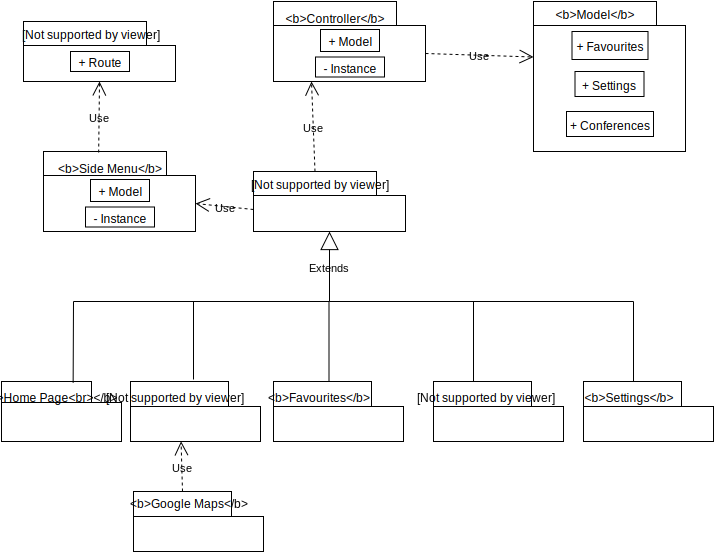

# openCX-nav-inc Development Report

Welcome to the documentation pages of the Campus NAV of **openCX**!

You can find here detailed about the (sub)product, hereby mentioned as module, from a high-level vision to low-level implementation decisions, a kind of Software Development Report (see [template](https://github.com/softeng-feup/open-cx/blob/master/docs/templates/Development-Report.md)), organized by discipline (as of RUP): 

* Business modeling 
  * [Product Vision](#Product-Vision)
  * [Elevator Pitch](#Elevator-Pitch)
* Requirements
  * [Use Case Diagram](#Use-case-diagram)
  * [User stories](#User-stories)
  * [Domain model](#Domain-model)
* Architecture and Design
  * [Logical architecture](#Logical-architecture)
  * [Physical architecture](#Physical-architecture)
  * [Prototype](#Prototype)
* [Implementation](#Implementation)
* [Test](#Test)
* [Configuration and change management](#Configuration-and-change-management)
* [Project management](#Project-management)

So far, contributions are exclusively made by the initial team, but we hope to open them to the community, in all areas and topics: requirements, technologies, development, experimentation, testing, etc.

Please contact us! 

Thank you!

Francisco Gonçalves, João Mota, Luís Ramos, Martim Pinto Silva, Matheus Stiehler

---

## Product Vision

Campus NAV is a navigational application for mobile that focuses on conferences and more importantly helping attendees navigating in unknown buildings that house theese conferences.

Campus NAV will allow its users to explore freely without any boundaries in an unknown environment and also provide extra information about the conferences currently taking place aswell as other scheduled conferences. The application will also allow the users to know a litle bit more about the building itself, giving attendees more freedom and thus a better overall experience.

---

## Elevator Pitch

Campus NAV is a mobile application that helps conferences attendants navigating inside buildings. This results in the use of less manpower to help attendants, and gives them a better overall experience.

---

## Requirements

The application should give the user a realiable realtime location and provide up to date information about conference schedules.

For this, the application needs to keep a stable connection with the various beacons scaterred through the buildings.

Both connection with the various beacons and the user location will be achieved using bluetooth in conjuction with open source APIs.

An online database will need to be used to store conferences. To be maintained there must be a website to allow staff and developers change the information.

### Use case diagram 

Create a use-case diagram in UML with all high-level use cases possibly addressed by your module.

Give each use case a concise, results-oriented name. Use cases should reflect the tasks the user needs to be able to accomplish using the system. Include an action verb and a noun. 

Briefly describe each use case mentioning the following:

#### Use Cases
* **Go to Conference**

**Actor**: Attendee

**Description**: After an attendee has arrived at a conference location, and has selected the conference, the application will guide him to the conference room.

**Preconditions**: Attendee has selected the conference that he would like to go to and has bluetooth turned on.

**Post-conditions**: App will search for optimal route. Attendee will be directed to the conference room.

**Normal Flow**:
1. The attendee turns bluetooth on.
2. The attendee will indicate that he wants to be guided to a conference he has selected.
3. The system will search for optimal route.
4. The attendee will follow directions given by the application.
5. The attendee will reach the conference location.
6. The application will issue a notification warning the user that he has arrived at the conference.

**Alternate Flows and Exceptions**:
The user goes off route -> The application must calculate new route.
The user is not in FEUP -> The application must give a warning and not calcute.
The user does not have bluetooth turned on -> The application needs to warn the user.

* **Visualize map**

**Actor**: Attendee

**Description**: The attendee presses the map button and the map will pop up and show his location on the map.

**Preconditions**: Attendee is in FEUP. Attendee has bluetooth turned on.

**Post-conditions**: Attendee will know where he is.

**Normal Flow**:
1. The attendee turns bluetooth on.
2. The attendee presses map button.
3. The application aquires his position.
4. The application shows the map.
5. The attendee knows is postion.

**Alternate Flows and Exceptions**:
The user is not in FEUP -> The application must give a warning and show map without position.
The user does not have bluetooth turned on -> The application needs to warn the user.

* **Go to places of interest**

**Actor**: Attendee

**Description**: After an attendee has arrived at a conference location, and has selected a point of interest (bathroom, coffee machine, bar, etc.), the application will guide him to it.

**Preconditions**: Attendee has selected a point of interest that he would like to go to and has bluetooth turned on.

**Post-conditions**: App will search for optimal route. Attendee will be directed to the point of interest.

**Normal Flow**:
1. The attendee turns bluetooth on.
2. The attendee will indicate that he wants to be guided to a point of interest he has selected.
3. The application will search for optimal route.
4. The attendee will follow directions given by the application.
5. The attendee will reach the point of interest location.
6. The application will issue a notification warning the user that he has arrived at the point of interest.

**Alternate Flows and Exceptions**:
The user goes off route -> The application must calculate new route.
The user is not in FEUP -> The application must give a warning and not calcute a route.
The user does not have bluetooth turned on -> The application needs to warn the user.

* **Check conference data**

**Actor**: Attendee

**Description**: After an attendee has opened the application he will go to homepage and see all conferences, when he presses the one he wants to know more about it will show him all available information about it.

**Preconditions**: Attendee has internet connection.

**Post-conditions**: App will acquire data from the online database. App will show all conferences returned from the database.

**Normal Flow**:
1. The attendee connects to the internet.
2. The attendee opens the application.
3. The application will acquire data from online database.
4. The application will show all conference data returned from database.
5. The attendee will choose conference that he wishes to see more about.
6. The application will show all data related to that conference.

**Alternate Flows and Exceptions**:
The user does not have internet connection -> The application needs to warn the user.

* **Modify Conferences**

**Actor**: Staff

**Description**: A staff member changes conferences listed on the database.

**Preconditions**: Staff has internet connection and is on the website.

**Post-conditions**: Website communicates with database and updates it.

**Normal Flow**:
1. The staff connects to the internet.
2. The staff goes to the database website.
3. The webiste will acquire data from database.
4. The staff will change conferences listed, possibly adding more or removing some.
5. The attendee will submit changes to database.
6. The website transmites changes to database.

**Alternate Flows and Exceptions**:
The information is not correct -> The website needs to warn the staff.

---
### User stories
**[User Stories markdown](https://github.com/softeng-feup/open-cx-nav-inc/blob/master/doc/user_stories.md)**

### Domain model

To better understand the context of the software system, it is very useful to have a simple UML class diagram with all the key concepts (names, attributes) and relationships involved of the problem domain addressed by your module.

---

## Architecture and Design
The architecture of a software system encompasses the set of key decisions about its overall organization. 

A well written architecture document is brief but reduces the amount of time it takes new programmers to a project to understand the code to feel able to make modifications and enhancements.

To document the architecture requires describing the decomposition of the system in their parts (high-level components) and the key behaviors and collaborations between them. 

In this section you should start by briefly describing the overall components of the project and their interrelations. You should also describe how you solved typical problems you may have encountered, pointing to well-known architectural and design patterns, if applicable.

### Logical architecture

The purpose of this subsection is to document the high-level logical structure of the code, using a UML diagram with logical packages, without the worry of allocating to components, processes or machines.

It can be beneficial to present the system both in a horizontal or vertical decomposition:
* horizontal decomposition may define layers and implementation concepts, such as the user interface, business logic and concepts; 
* vertical decomposition can define a hierarchy of subsystems that cover all layers of implementation.

### Physical architecture

The goal of this subsection is to document the high-level physical structure of the software system (machines, connections, software components installed, and their dependencies) using UML deployment diagrams or component diagrams (separate or integrated), showing the physical structure of the system.

It should describe also the technologies considered and justify the selections made. Examples of technologies relevant for openCX are, for example, frameworks for mobile applications (Flutter vs ReactNative vs ...), languages to program with microbit, and communication with things (beacons, sensors, etc.).

### Prototype
To help on validating all the architectural, design and technological decisions made, we usually implement a vertical prototype, a thin vertical slice of the system.

In this subsection please describe in more detail which, and how, user(s) story(ies) were implemented.

---

## Implementation
During implementation, while not necessary, it 

It might be also useful to explain a few aspects of the code that have the greatest potential to confuse software engineers about how it works. 

Since the code should speak by itself, try to keep this section as short and simple as possible.

Use cross-links to the code repository and only embed real fragments of code when strictly needed, since they tend to become outdated very soon.

---
## Test

There are several ways of documenting testing activities, and quality assurance in general, being the most common: a strategy, a plan, test case specifications, and test checklists.

In this section it is only expected to include the following:
* test plan describing the list of features to be tested and the testing methods and tools;
* test case specifications to verify the functionalities, using unit tests and acceptance tests.
 
A good practice is to simplify this, avoiding repetitions, and automating the testing actions as much as possible.

---
## Configuration and change management

Configuration and change management are key activities to control change to, and maintain the integrity of, a project’s artifacts (code, models, documents).

For the purpose of ESOF, we will use a very simple approach, just to manage feature requests, bug fixes, and improvements, using GitHub issues and following the [GitHub flow](https://guides.github.com/introduction/flow/).

---

## Project management

**[Trello Link](https://trello.com/b/XgQ9OzGB)**

The project management is done using [Trello](https://trello.com) with the following structure:

**BackLog**: User stories planned for the project that are not yet done.

**To Do**: User stories to be done in the upcoming weeks.

**Doing**: User stories that are currently being worked on.

**Done**: User stories that have already been done and successfully tested.

